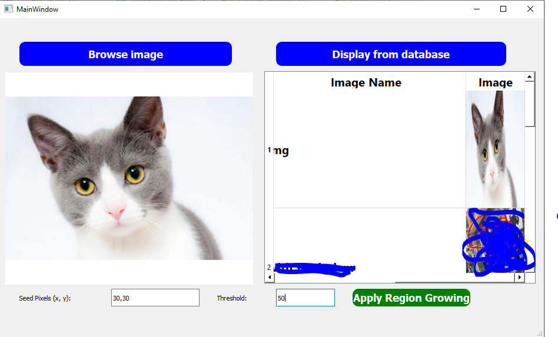

# images_processing
# Pour exécuter ce code il faut : 
  - Créer un environnement virtuel pour y ajouter les packages nécessaire : python -m venv venv
  - Installer les package : PyQt5, ,mysql.connector, numpy, Pillow,
# demonstration

